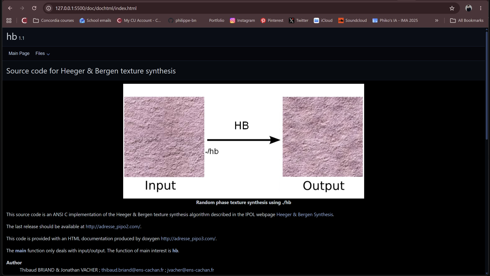
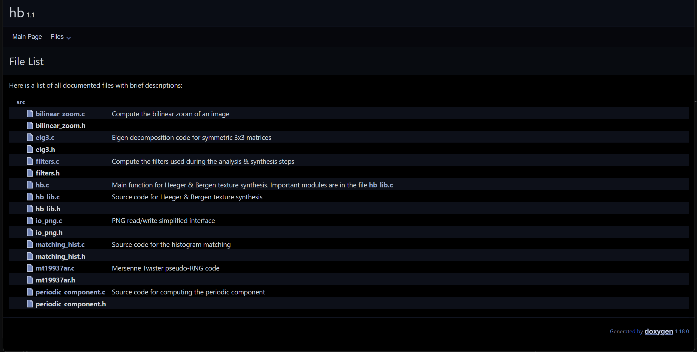

**06/10/26**
*RESEARCH & DEVELOPMENT*
This week, I started with research about the various algorithms for texture generation. 
- I read the *Textures* text here ("https://visionbook.mit.edu/textures.html"). 
- I identified the Heeger-Bergen Texture Synthesis algorithm as one I would want to work with and dive deeper into.
- I found this Github repo with an implementation in C# of the algorithm: https://github.com/tbriand/hb_texture_synthesis
For the next steps: 
- I want to check if using this repo would be pertinent.
- I can run basic tests with the algorithm, identifying what each stage of the process affects in the final outcome and where there is space for input data / iteration / bias.
*PHYSICAL COMPUTING*
I also met with someone on Facebook Marketplace who sold me a thermal receipt printer (BTP-R880NP) for 70$.
- It turns on when plugged in and had a paper roll inside of it already.
- It is able to feed paper.
- It requires a USB cable which I would need to find (USB to USB), and I don't know if this will be enough to set up the connection.
- I will need to ask Emile if he can help me "jailbreak" it, like he did with his.

**07/10/26**
 Succeeded at running HTML documentation of repo.
 The repo indicates what each file accomplishes.